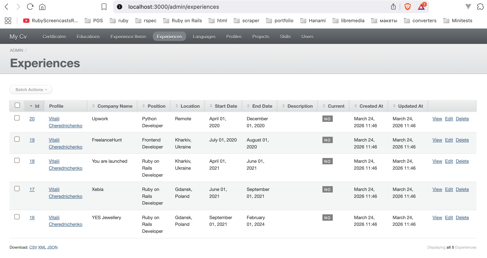
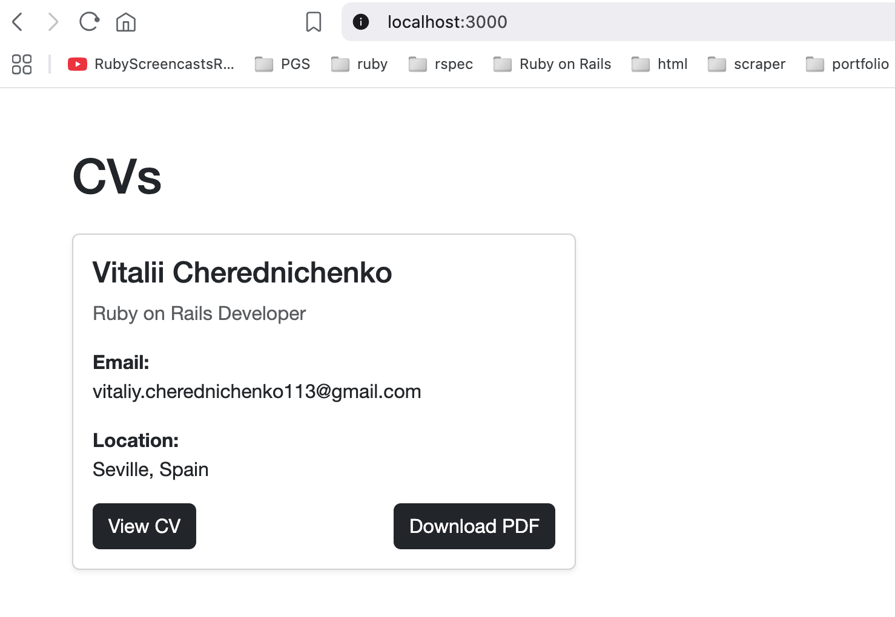
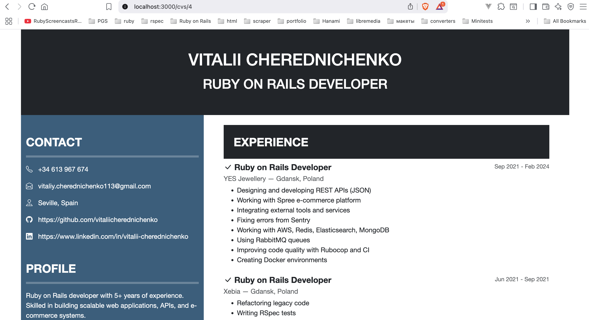
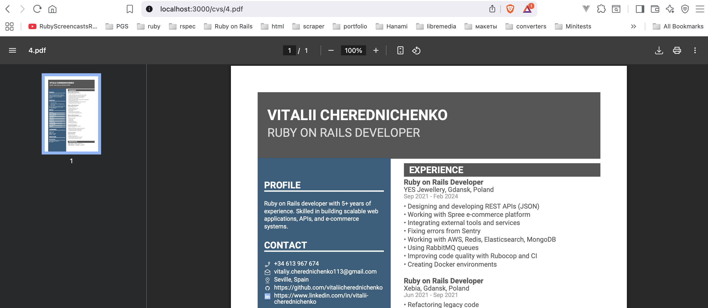

# CVsApp

**MyCV** is a Ruby on Rails web application for content management, PDF resume generation, ActiveAdmin for admin panel and Devise for user authentication.  

The application allows you to:  

- Manage user profiles (`Profile`) and their data: work experience, skills, languages, education, certificates, projects.  
- View resumes through a web interface (`HTML`) or download as PDF (`CvPdf`).  
- Manage users with Devise: registration, password recovery, authentication.  

---

## Technologies

- Ruby on Rails 7+  
- Devise (user authentication)  
- Prawn (PDF generation)  
- RSpec + FactoryBot (testing)  

---

## Installation

1. Clone the repository:  

```bash
git clone https://github.com/vitaliicherednichenko/my_cv.git
cd my_cv
```
Install dependencies:
```
bundle install
```
Set up the database (PostgreSQL):
```
rails db:create
rails db:migrate
rails db:seed
Start the server:
rails server
```

The application will be accessible at http://localhost:3000/.

The admin panel will be accessible at http://localhost:3000/admin.

## Main Routes
```
GET	/admin	List of all editing models
```

```
GET	/cvs	List all profiles
```

```
GET	/cvs/:id	View a profile resume (HTML)
```

```
GET	/cvs/:id.pdf	Download a profile resume as PDF Generation (CvPdf)
```


The CvPdf class (in app/pdfs/cv_pdf.rb) handles PDF resume generation:

Sidebar: profile, contacts, skills, languages, education
Main section: work experience and certificates
Uses Roboto fonts and icons for contacts
PDF generation is integrated in CvsController#show

## Testing

The project uses RSpec and FactoryBot:

```
bundle exec rspec
```

Tests include:

Models (User, Profile)
Controllers (CvsController)
PDF generation (CvPdf)

## Seeds (example)

You can create sample user and profile for testing:

```
User.create!(email: 'admin@example.com', password: 'password', password_confirmation: 'password')

Profile.create!(
  full_name: 'John Doe',
  title: 'Backend Developer',
  summary: 'Experienced backend developer',
  email: 'john@example.com',
  phone: '+123456789',
  location: 'Gdańsk, Poland',
  github_url: 'https://github.com/johndoe',
  linkedin_url: 'https://linkedin.com/in/johndoe'
)
```

## What's Next

Planned improvements for the CVsApp include:

1. **Adding Images to CVs**  
   - Allow users to upload profile pictures or other images.  
   - Ensure images display correctly in both HTML and PDF resumes.

2. **Adding Data via Pop-up Forms**  
   - Implement dynamic pop-up forms for adding or editing CV sections.  
   - Improve user experience by enabling in-place updates without navigating to separate pages.

3. **I18n Translations**  
   - Introduce internationalization (I18n) to support multiple languages.  
   - Make the application accessible to users in different regions with localized UI and CV content.
